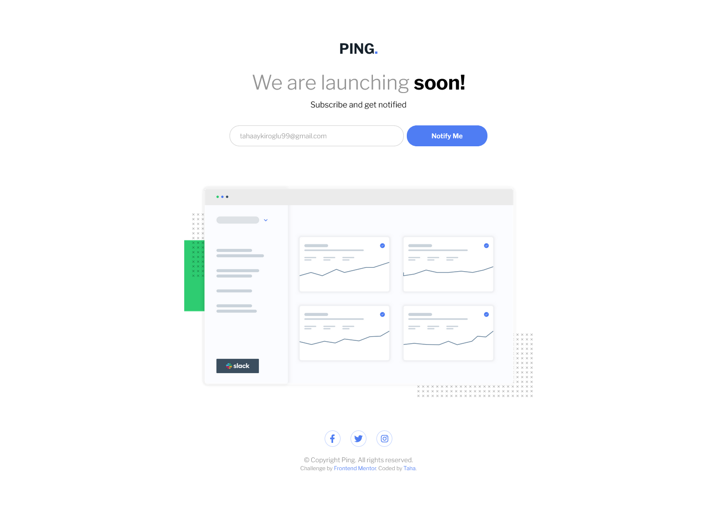
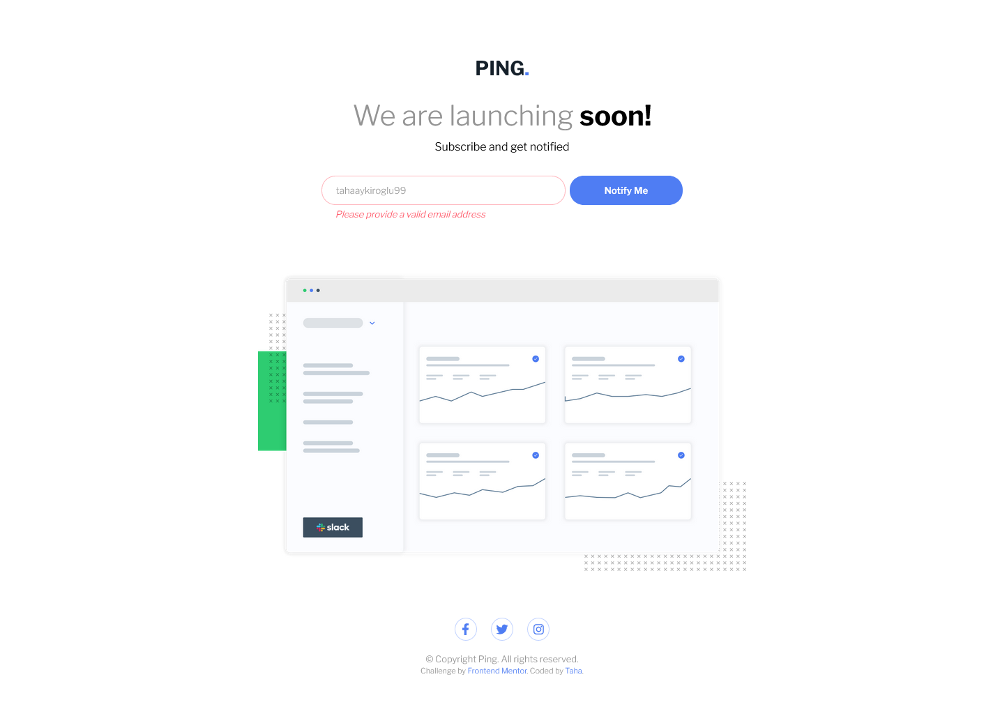

# Frontend Mentor - Ping Single Column Coming Soon Page

This is a solution to the [Ping Single Column Coming Soon Page Challenge on Frontend Mentor](https://www.frontendmentor.io/challenges/ping-single-column-coming-soon-page-5cadd051fec04111f7b848da).

## Table of contents

- [Overview](#overview)
- [The challenge](#the-challenge)
- [Screenshot](#screenshot)
- [Links](#links)
- [Built with](#built-with)
- [Author](#author)

## Overview

### The challenge

Users should be able to:

- View the optimal layout depending on their device's screen size
- See hover states for all interactive elements on the page
- Submit their email address using an input field
- Receive an error message when the form is submitted if:
  - The input field is empty
  - The email address is not formatted correctly

### Screenshot

#### Desktop View

#### Desktop Error View

#### Mobile View

 

#### Mobile Error View

### Links

- Solution URL: [Frontend Mentor](https://www.frontendmentor.io/profile/thaykrgl)
- Live Site URL: [Github Pages](https://thaykrgl.github.io/ping-coming-soon-page/)

## My process

### Built with

- Semantic HTML5 markup
- CSS Custom Properties
- Mobile-first Workflow
- Flexbox
- Font Awesome
- Google Fonts
- Regular Expressions

## Author

- Linkedin - [Taha](https://www.linkedin.com/in/tahaaykiroglu)
- Frontend Mentor - [@thaykrgl](https://www.frontendmentor.io/profile/thaykrgl)
